# GridLens Data Model

**Document purpose:** Describe the initial relational data model for the
GridLens multi-tenant utility intelligence platform.

This model is intentionally product-oriented. It names the tables the platform
expects to need, explains what each table is for, and calls out the indexes and
constraints that should shape the first implementation. Physical details may
change during implementation, but tenant isolation, auditability, traceability,
and explainable AI behavior are core requirements.

## Design Principles

- **Tenant isolation is explicit.** Tenant-owned records carry `tenant_id`.
  Application code and database policy should enforce tenant scoping
  server-side.
- **Operational facts are traceable.** Imported readings, bills, reports,
  assistant answers, and evaluation outputs link back to source documents,
  ingestion jobs, or generated runs.
- **Sensitive identifiers are masked and hashed.** Utility account numbers and
  meter numbers are stored as masked display values plus hashes for matching.
  Raw account or meter numbers should not be persisted.
- **Generated outputs are first-class records.** Reports, assistant responses,
  retrievals, quality reports, and evaluation runs are stored with enough
  metadata to explain how they were produced.
- **JSON fields are controlled extension points.** `jsonb` columns support
  flexible configuration, summaries, and source metadata, but should not hide
  stable relational entities.

## Entity Relationship Diagram

```mermaid
erDiagram
    TENANTS {
        uuid id PK
        text name
        text slug UK
        text status
        timestamptz created_at
        timestamptz updated_at
    }

    APP_USERS {
        uuid id PK
        text email UK
        text display_name
        text external_auth_provider
        text external_subject UK
        text status
        timestamptz created_at
        timestamptz updated_at
    }

    TENANT_MEMBERSHIPS {
        uuid id PK
        uuid tenant_id FK
        uuid user_id FK
        text role
        text status
        timestamptz invited_at
        timestamptz joined_at
        timestamptz created_at
        timestamptz updated_at
    }

    PROPERTIES {
        uuid id PK
        uuid tenant_id FK
        text name
        text property_code
        text property_type
        text address_line_1
        text address_line_2
        text city
        text province
        text country
        numeric floor_area
        text floor_area_unit
        timestamptz created_at
        timestamptz updated_at
    }

    UTILITY_PROVIDERS {
        uuid id PK
        text name
        text provider_code
        text country
        text service_type
        timestamptz created_at
        timestamptz updated_at
    }

    UTILITY_ACCOUNTS {
        uuid id PK
        uuid tenant_id FK
        uuid provider_id FK
        text account_name
        text account_number_hash
        text account_number_masked
        text service_type
        text status
        timestamptz created_at
        timestamptz updated_at
    }

    METERS {
        uuid id PK
        uuid tenant_id FK
        uuid property_id FK
        uuid utility_account_id FK
        text meter_number_hash
        text meter_number_masked
        text service_type
        text unit_of_measure
        text status
        timestamptz installed_at
        timestamptz retired_at
        timestamptz created_at
        timestamptz updated_at
    }

    METER_READINGS {
        uuid id PK
        uuid tenant_id FK
        uuid meter_id FK
        uuid ingestion_job_id FK
        timestamptz period_start_at
        timestamptz period_end_at
        numeric usage_amount
        text unit_of_measure
        text reading_source
        text quality_status
        timestamptz created_at
        timestamptz updated_at
    }

    BILLING_STATEMENTS {
        uuid id PK
        uuid tenant_id FK
        uuid utility_account_id FK
        uuid document_id FK
        text statement_number
        date billing_period_start
        date billing_period_end
        date issued_date
        date due_date
        numeric total_usage
        text usage_unit
        numeric total_amount
        text currency
        text status
        timestamptz created_at
        timestamptz updated_at
    }

    BILL_LINE_ITEMS {
        uuid id PK
        uuid tenant_id FK
        uuid billing_statement_id FK
        uuid meter_id FK
        text line_type
        text description
        numeric quantity
        text unit_of_measure
        numeric unit_price
        numeric amount
        timestamptz created_at
        timestamptz updated_at
    }

    RATE_PLANS {
        uuid id PK
        uuid tenant_id FK
        uuid provider_id FK
        text name
        text service_type
        text currency
        boolean is_active
        timestamptz created_at
        timestamptz updated_at
    }

    RATE_COMPONENTS {
        uuid id PK
        uuid tenant_id FK
        uuid rate_plan_id FK
        text component_type
        text description
        numeric tier_start
        numeric tier_end
        numeric price_per_unit
        text unit_of_measure
        timestamptz effective_from
        timestamptz effective_to
        timestamptz created_at
        timestamptz updated_at
    }

    ACCOUNT_RATE_PLANS {
        uuid id PK
        uuid tenant_id FK
        uuid utility_account_id FK
        uuid rate_plan_id FK
        timestamptz effective_from
        timestamptz effective_to
        timestamptz created_at
        timestamptz updated_at
    }

    DOCUMENTS {
        uuid id PK
        uuid tenant_id FK
        uuid uploaded_by_user_id FK
        text file_name
        text file_type
        text storage_bucket
        text storage_key
        text checksum_sha256
        bigint file_size_bytes
        text source_type
        timestamptz created_at
    }

    INGESTION_SOURCES {
        uuid id PK
        uuid tenant_id FK
        text name
        text source_type
        text provider
        jsonb config_json
        text status
        timestamptz created_at
        timestamptz updated_at
    }

    INGESTION_JOBS {
        uuid id PK
        uuid tenant_id FK
        uuid ingestion_source_id FK
        uuid document_id FK
        text job_type
        text status
        int records_processed
        int records_failed
        timestamptz started_at
        timestamptz completed_at
        text error_message
        timestamptz created_at
        timestamptz updated_at
    }

    INGESTION_ERRORS {
        uuid id PK
        uuid tenant_id FK
        uuid ingestion_job_id FK
        int row_number
        text error_code
        text error_message
        jsonb raw_record
        timestamptz created_at
    }

    DATA_QUALITY_REPORTS {
        uuid id PK
        uuid tenant_id FK
        uuid ingestion_job_id FK
        uuid document_id FK
        text report_type
        text status
        int total_records
        int valid_records
        int invalid_records
        jsonb summary_json
        timestamptz created_at
        timestamptz updated_at
    }

    EVALUATION_RUNS {
        uuid id PK
        uuid tenant_id FK
        uuid document_id FK
        text evaluation_type
        text status
        date period_start
        date period_end
        jsonb summary_json
        timestamptz started_at
        timestamptz completed_at
        timestamptz created_at
    }

    ALERT_RULES {
        uuid id PK
        uuid tenant_id FK
        uuid property_id FK
        uuid meter_id FK
        text name
        text rule_type
        jsonb condition_json
        text severity
        boolean is_active
        timestamptz created_at
        timestamptz updated_at
    }

    ALERT_EVENTS {
        uuid id PK
        uuid tenant_id FK
        uuid alert_rule_id FK
        uuid property_id FK
        uuid meter_id FK
        text severity
        text status
        text title
        text message
        timestamptz triggered_at
        timestamptz resolved_at
        timestamptz created_at
        timestamptz updated_at
    }

    ANOMALIES {
        uuid id PK
        uuid tenant_id FK
        uuid property_id FK
        uuid meter_id FK
        timestamptz period_start_at
        timestamptz period_end_at
        numeric actual_usage
        numeric expected_usage
        numeric variance_amount
        numeric variance_percent
        text severity
        text status
        timestamptz created_at
        timestamptz updated_at
    }

    REPORTS {
        uuid id PK
        uuid tenant_id FK
        uuid created_by_user_id FK
        text name
        text report_type
        jsonb filters_json
        jsonb layout_json
        boolean is_shared
        timestamptz created_at
        timestamptz updated_at
    }

    REPORT_RUNS {
        uuid id PK
        uuid tenant_id FK
        uuid report_id FK
        uuid document_id FK
        text status
        timestamptz started_at
        timestamptz completed_at
        timestamptz created_at
    }

    ASSISTANT_DOCUMENTS {
        uuid id PK
        uuid tenant_id FK
        uuid document_id FK
        uuid uploaded_by_user_id FK
        uuid approved_by_user_id FK
        text title
        text document_type
        text approval_status
        text indexing_status
        text processing_error
        timestamptz approved_at
        timestamptz created_at
        timestamptz updated_at
    }

    ASSISTANT_DOCUMENT_CHUNKS {
        uuid id PK
        uuid tenant_id FK
        uuid assistant_document_id FK
        int chunk_index
        text chunk_text
        text chunk_hash
        int token_count
        int char_start
        int char_end
        jsonb metadata_json
        text embedding_model
        int embedding_dimensions
        vector embedding
        text embedding_status
        timestamptz embedded_at
        timestamptz created_at
    }

    ASSISTANT_DOCUMENT_FLAGS {
        uuid id PK
        uuid tenant_id FK
        uuid assistant_document_id FK
        uuid chunk_id FK
        uuid reviewed_by_user_id FK
        text flag_type
        text severity
        text flagged_text
        text status
        timestamptz created_at
        timestamptz reviewed_at
    }

    ASSISTANT_SESSIONS {
        uuid id PK
        uuid tenant_id FK
        uuid user_id FK
        text title
        timestamptz created_at
        timestamptz updated_at
    }

    ASSISTANT_MESSAGES {
        uuid id PK
        uuid tenant_id FK
        uuid session_id FK
        uuid user_id FK
        text role
        text content
        text answer_status
        timestamptz created_at
    }

    ASSISTANT_INTERACTIONS {
        uuid id PK
        uuid tenant_id FK
        uuid session_id FK
        uuid user_message_id FK
        uuid assistant_message_id FK
        text interaction_status
        int prompt_tokens
        int completion_tokens
        int total_tokens
        int latency_ms
        numeric estimated_cost
        text model_name
        text embedding_model
        text refusal_reason
        timestamptz created_at
    }

    ASSISTANT_RETRIEVALS {
        uuid id PK
        uuid tenant_id FK
        uuid interaction_id FK
        uuid chunk_id FK
        numeric similarity_score
        int rank_position
        boolean was_used_in_answer
        timestamptz created_at
    }

    ASSISTANT_MESSAGE_SOURCES {
        uuid id PK
        uuid tenant_id FK
        uuid assistant_message_id FK
        uuid assistant_document_id FK
        uuid chunk_id FK
        uuid evaluation_run_id FK
        uuid data_quality_report_id FK
        uuid report_run_id FK
        text source_type
        text source_title
        text citation_label
        jsonb source_metadata_json
        timestamptz created_at
    }

    ASSISTANT_EVALUATION_CASES {
        uuid id PK
        uuid tenant_id FK
        text name
        text test_type
        text prompt
        text expected_behavior
        boolean is_active
        timestamptz created_at
        timestamptz updated_at
    }

    ASSISTANT_EVALUATION_RUNS {
        uuid id PK
        uuid tenant_id FK
        uuid evaluation_case_id FK
        text status
        text observed_behavior
        boolean passed
        timestamptz started_at
        timestamptz completed_at
        timestamptz created_at
    }

    AUDIT_LOGS {
        uuid id PK
        uuid tenant_id FK
        uuid actor_user_id FK
        text action
        text entity_type
        uuid entity_id
        jsonb before_json
        jsonb after_json
        timestamptz created_at
    }

    TENANTS ||--o{ TENANT_MEMBERSHIPS : has
    APP_USERS ||--o{ TENANT_MEMBERSHIPS : belongs_to

    TENANTS ||--o{ PROPERTIES : owns
    TENANTS ||--o{ UTILITY_ACCOUNTS : owns
    UTILITY_PROVIDERS ||--o{ UTILITY_ACCOUNTS : provides

    PROPERTIES ||--o{ METERS : contains
    UTILITY_ACCOUNTS ||--o{ METERS : has
    METERS ||--o{ METER_READINGS : records

    TENANTS ||--o{ BILLING_STATEMENTS : owns
    UTILITY_ACCOUNTS ||--o{ BILLING_STATEMENTS : receives
    BILLING_STATEMENTS ||--o{ BILL_LINE_ITEMS : contains
    METERS ||--o{ BILL_LINE_ITEMS : may_reference

    UTILITY_PROVIDERS ||--o{ RATE_PLANS : offers
    RATE_PLANS ||--o{ RATE_COMPONENTS : contains
    UTILITY_ACCOUNTS ||--o{ ACCOUNT_RATE_PLANS : uses
    RATE_PLANS ||--o{ ACCOUNT_RATE_PLANS : assigned_to

    TENANTS ||--o{ DOCUMENTS : owns
    APP_USERS ||--o{ DOCUMENTS : uploads
    DOCUMENTS ||--o{ BILLING_STATEMENTS : supports
    DOCUMENTS ||--o{ INGESTION_JOBS : input_for
    DOCUMENTS ||--o{ DATA_QUALITY_REPORTS : output_for
    DOCUMENTS ||--o{ EVALUATION_RUNS : output_for
    DOCUMENTS ||--o{ REPORT_RUNS : output_for

    TENANTS ||--o{ INGESTION_SOURCES : configures
    INGESTION_SOURCES ||--o{ INGESTION_JOBS : runs
    INGESTION_JOBS ||--o{ INGESTION_ERRORS : produces
    INGESTION_JOBS ||--o{ METER_READINGS : imports
    INGESTION_JOBS ||--o{ DATA_QUALITY_REPORTS : produces

    TENANTS ||--o{ ALERT_RULES : defines
    PROPERTIES ||--o{ ALERT_RULES : scopes
    METERS ||--o{ ALERT_RULES : scopes
    ALERT_RULES ||--o{ ALERT_EVENTS : triggers
    PROPERTIES ||--o{ ALERT_EVENTS : receives
    METERS ||--o{ ALERT_EVENTS : receives

    PROPERTIES ||--o{ ANOMALIES : has
    METERS ||--o{ ANOMALIES : has

    TENANTS ||--o{ REPORTS : owns
    APP_USERS ||--o{ REPORTS : creates
    REPORTS ||--o{ REPORT_RUNS : generates

    DOCUMENTS ||--o| ASSISTANT_DOCUMENTS : registered_as
    TENANTS ||--o{ ASSISTANT_DOCUMENTS : owns
    APP_USERS ||--o{ ASSISTANT_DOCUMENTS : uploads
    APP_USERS ||--o{ ASSISTANT_DOCUMENTS : approves

    ASSISTANT_DOCUMENTS ||--o{ ASSISTANT_DOCUMENT_CHUNKS : split_into
    ASSISTANT_DOCUMENTS ||--o{ ASSISTANT_DOCUMENT_FLAGS : may_have
    ASSISTANT_DOCUMENT_CHUNKS ||--o{ ASSISTANT_DOCUMENT_FLAGS : may_have

    TENANTS ||--o{ ASSISTANT_SESSIONS : owns
    APP_USERS ||--o{ ASSISTANT_SESSIONS : starts
    ASSISTANT_SESSIONS ||--o{ ASSISTANT_MESSAGES : contains
    APP_USERS ||--o{ ASSISTANT_MESSAGES : sends

    ASSISTANT_SESSIONS ||--o{ ASSISTANT_INTERACTIONS : has
    ASSISTANT_MESSAGES ||--o| ASSISTANT_INTERACTIONS : user_prompt_for
    ASSISTANT_MESSAGES ||--o| ASSISTANT_INTERACTIONS : assistant_answer_for

    ASSISTANT_INTERACTIONS ||--o{ ASSISTANT_RETRIEVALS : retrieves
    ASSISTANT_DOCUMENT_CHUNKS ||--o{ ASSISTANT_RETRIEVALS : retrieved_as_context

    ASSISTANT_MESSAGES ||--o{ ASSISTANT_MESSAGE_SOURCES : cites
    ASSISTANT_DOCUMENTS ||--o{ ASSISTANT_MESSAGE_SOURCES : cited_by
    ASSISTANT_DOCUMENT_CHUNKS ||--o{ ASSISTANT_MESSAGE_SOURCES : cited_by
    EVALUATION_RUNS ||--o{ ASSISTANT_MESSAGE_SOURCES : cited_by
    DATA_QUALITY_REPORTS ||--o{ ASSISTANT_MESSAGE_SOURCES : cited_by
    REPORT_RUNS ||--o{ ASSISTANT_MESSAGE_SOURCES : cited_by

    TENANTS ||--o{ ASSISTANT_EVALUATION_CASES : owns
    ASSISTANT_EVALUATION_CASES ||--o{ ASSISTANT_EVALUATION_RUNS : runs

    TENANTS ||--o{ AUDIT_LOGS : records
    APP_USERS ||--o{ AUDIT_LOGS : performs
```

## Domain Areas

### Identity and Tenancy

| Table | Purpose | Important notes |
| --- | --- | --- |
| `tenants` | Organization workspace boundary. Every tenant-owned product record should be queryable through this table. | `slug` is the stable human-readable identifier used in URLs and admin workflows. |
| `app_users` | Platform-level user identity. A user can belong to multiple tenants. | `external_auth_provider` and `external_subject` connect the user to the configured identity provider. |
| `tenant_memberships` | Join table between users and tenants, including role and membership lifecycle. | Use this table for authorization checks and invitation state; do not infer access from ownership of other records. |

### Utility Asset Model

| Table | Purpose | Important notes |
| --- | --- | --- |
| `properties` | Tenant-owned buildings, sites, or facilities where utility consumption occurs. | `property_code` should be unique per tenant when supplied; addresses support grouping and reporting. |
| `utility_providers` | Reference data for utilities, suppliers, or distribution companies. | This table is shared reference data and does not require `tenant_id`; tenant-specific provider settings should live elsewhere if needed. |
| `utility_accounts` | Tenant-owned accounts with a provider for a service such as electricity, gas, or water. | Store masked and hashed account numbers only. The hash supports deduplication and matching without retaining raw identifiers. |
| `meters` | Physical or logical measuring devices attached to a property and utility account. | A meter belongs to one tenant, usually one property, and one utility account. Retired meters remain for historical readings. |
| `meter_readings` | Periodic usage facts imported from files, integrations, bills, or manual entry. | Readings link to `ingestion_jobs` for lineage and carry `quality_status` for downstream filtering. |

### Billing and Rates

| Table | Purpose | Important notes |
| --- | --- | --- |
| `billing_statements` | Header-level utility bill data for an account and billing period. | Can link to the original bill file in `documents`. Statement numbers may not be globally unique. |
| `bill_line_items` | Itemized charges, taxes, demand charges, credits, and usage lines from a bill. | `meter_id` is nullable because some charges apply to an account or bill instead of a single meter. |
| `rate_plans` | Named tariff or pricing plan used to estimate costs and explain charges. | Tenant-scoped so users can model custom or negotiated plans. |
| `rate_components` | Structured components within a rate plan, such as fixed fees, energy tiers, demand charges, and seasonal prices. | Effective dates support changing tariffs over time. |
| `account_rate_plans` | Effective-dated assignment of rate plans to utility accounts. | Prevent overlapping effective periods per account and service type. |

### Documents, Ingestion, and Data Quality

| Table | Purpose | Important notes |
| --- | --- | --- |
| `documents` | Metadata for uploaded or generated files stored outside the database. | The database stores storage location, checksum, type, and owner; file bytes remain in object storage. |
| `ingestion_sources` | Reusable source configurations, such as manual CSV upload, SFTP feed, provider API, or scheduled import. | `config_json` should contain non-secret configuration only; credentials belong in a secret manager. |
| `ingestion_jobs` | Execution record for an import, parse, validation, or normalization run. | Tracks status, counters, timing, source document, and source configuration. |
| `ingestion_errors` | Row-level or record-level import failures. | `raw_record` is useful for debugging but must follow the public-safe and privacy rules for the project. |
| `data_quality_reports` | Aggregated validation result for an ingestion job or source document. | `summary_json` stores validation counts, drift metrics, and report-specific details that are not stable columns yet. |

### Evaluation, Monitoring, and Alerts

| Table | Purpose | Important notes |
| --- | --- | --- |
| `evaluation_runs` | Program evaluation or analytics run that produces savings, baseline, or impact summaries. | The initial shape stores summary metadata; detailed result tables can be added when evaluation methods are implemented. |
| `alert_rules` | Tenant-defined rules for surfacing quality, usage, cost, or anomaly conditions. | Rules can be scoped to a property, meter, or tenant-wide pattern through nullable scope columns. |
| `alert_events` | Concrete alert occurrences produced by rules. | Events keep lifecycle status, trigger time, and resolution time for dashboards and audit. |
| `anomalies` | Detected usage deviations for properties or meters. | Stores actual versus expected values and variance so users can investigate outliers. |

### Reporting

| Table | Purpose | Important notes |
| --- | --- | --- |
| `reports` | Saved report definitions, filters, and layouts. | Shared reports remain tenant-scoped; private report access can be enforced through creator and role checks. |
| `report_runs` | Generated report executions and exported artifacts. | Links to `documents` when a PDF, CSV, or evidence package is generated. |

### Evidence-Grounded AI Assistant

| Table | Purpose | Important notes |
| --- | --- | --- |
| `assistant_documents` | Tenant-approved documents that can be indexed for AI retrieval. | Approval and indexing are separate states so unapproved content is never used as grounding evidence. |
| `assistant_document_chunks` | Searchable text chunks with embedding metadata. | Uses a vector column for semantic retrieval and metadata for filtering by document type, source, or period. |
| `assistant_document_flags` | Review findings for unsafe, stale, sensitive, low-quality, or otherwise unsuitable assistant source content. | Flags can apply to an entire assistant document or to one chunk. |
| `assistant_sessions` | Conversation container for one user in one tenant. | Sessions keep chat history grouped without making the assistant state global. |
| `assistant_messages` | Individual user and assistant chat messages. | Assistant content should be stored with status so refusals and incomplete answers are visible. |
| `assistant_interactions` | Operational metadata for one model call and response pair. | Stores token counts, latency, model names, cost estimate, and refusal reason for governance. |
| `assistant_retrievals` | Retrieved chunks considered for an assistant interaction. | Captures rank, similarity, and whether a chunk was actually used in the final answer. |
| `assistant_message_sources` | Citations attached to assistant answers. | Can cite document chunks, evaluation runs, quality reports, and generated reports. |
| `assistant_evaluation_cases` | Test prompts and expected behaviors for assistant quality checks. | Useful for regression tests around grounding, refusal, and tenant isolation. |
| `assistant_evaluation_runs` | Results of running assistant evaluation cases. | Stores observed behavior and pass/fail outcome for quality tracking. |

### Audit

| Table | Purpose | Important notes |
| --- | --- | --- |
| `audit_logs` | Immutable record of important user and system actions. | Use for uploads, approvals, data changes, exports, permission changes, and AI-sensitive actions. |

## Recommended Constraints

| Table | Constraint | Reason |
| --- | --- | --- |
| `tenants` | `unique(slug)` | Prevent ambiguous workspace URLs and admin references. |
| `app_users` | `unique(lower(email))` and `unique(external_auth_provider, external_subject)` | Keep login identity stable while supporting external identity providers. |
| `tenant_memberships` | `unique(tenant_id, user_id)` | Prevent duplicate membership rows for the same user and tenant. |
| `properties` | `unique(tenant_id, property_code)` where `property_code is not null` | Allow tenant-local property codes without requiring global uniqueness. |
| `utility_providers` | `unique(country, service_type, provider_code)` | Avoid duplicate provider reference records. |
| `utility_accounts` | `unique(tenant_id, provider_id, account_number_hash)` where `account_number_hash is not null` | Detect duplicate account imports without storing raw account numbers. |
| `meters` | `unique(tenant_id, utility_account_id, meter_number_hash)` where `meter_number_hash is not null` | Prevent duplicate meter records for the same account. |
| `meter_readings` | `unique(tenant_id, meter_id, period_start_at, period_end_at, reading_source)` | Prevent duplicate period readings from the same source. |
| `billing_statements` | `unique(tenant_id, utility_account_id, statement_number)` where `statement_number is not null` | Avoid duplicate bills when a provider supplies stable statement numbers. |
| `rate_components` | `check(tier_end is null or tier_end > tier_start)` | Keep tier ranges valid. |
| `account_rate_plans` | Exclusion or application constraint preventing overlapping periods per `tenant_id, utility_account_id` | Ensure cost calculations pick one active rate plan for a given period. |
| `documents` | `unique(tenant_id, checksum_sha256)` where `checksum_sha256 is not null` | Detect duplicate uploads inside a tenant. |
| `assistant_documents` | `unique(tenant_id, document_id)` | Avoid indexing the same document more than once for the same tenant. |
| `assistant_document_chunks` | `unique(tenant_id, assistant_document_id, chunk_index)` and `unique(tenant_id, assistant_document_id, chunk_hash)` | Keep chunk ordering stable and prevent duplicate indexed text. |
| `assistant_interactions` | `unique(tenant_id, user_message_id)` and `unique(tenant_id, assistant_message_id)` | Ensure each prompt/answer pair maps to a single interaction record. |

## Recommended Indexes

| Table | Index | Supports |
| --- | --- | --- |
| `tenant_memberships` | `(user_id, status)` | Finding active workspaces for a signed-in user. |
| `tenant_memberships` | `(tenant_id, role, status)` | Tenant admin user management and authorization checks. |
| `properties` | `(tenant_id, name)` | Property lists and search within a tenant. |
| `properties` | `(tenant_id, city, province, country)` | Geographic filtering and dashboard grouping. |
| `utility_accounts` | `(tenant_id, provider_id, service_type, status)` | Account browsing and provider-specific workflows. |
| `meters` | `(tenant_id, property_id, service_type, status)` | Property detail pages and meter inventory screens. |
| `meters` | `(tenant_id, utility_account_id)` | Account-to-meter lookups. |
| `meter_readings` | `(tenant_id, meter_id, period_start_at desc)` | Time-series charts and recent-reading queries. |
| `meter_readings` | `(tenant_id, quality_status, created_at desc)` | Data quality review queues. |
| `billing_statements` | `(tenant_id, utility_account_id, billing_period_start desc)` | Bill history by account. |
| `billing_statements` | `(tenant_id, status, due_date)` | Payment/status review workflows. |
| `bill_line_items` | `(tenant_id, billing_statement_id)` | Expanding a bill into line items. |
| `rate_components` | `(tenant_id, rate_plan_id, effective_from, effective_to)` | Rate lookup for a billing or evaluation period. |
| `account_rate_plans` | `(tenant_id, utility_account_id, effective_from, effective_to)` | Account rate resolution by date. |
| `documents` | `(tenant_id, created_at desc)` | Document library listing. |
| `documents` | `(tenant_id, source_type, file_type)` | Filtering uploads and generated artifacts. |
| `ingestion_sources` | `(tenant_id, source_type, status)` | Source management and scheduler scans. |
| `ingestion_jobs` | `(tenant_id, status, created_at desc)` | Operations dashboards and worker polling. |
| `ingestion_jobs` | `(tenant_id, ingestion_source_id, created_at desc)` | Job history for one source. |
| `ingestion_errors` | `(tenant_id, ingestion_job_id, row_number)` | Validation error drilldown. |
| `data_quality_reports` | `(tenant_id, ingestion_job_id)` | Linking job results to quality summaries. |
| `data_quality_reports` | `(tenant_id, status, created_at desc)` | Quality report review queues. |
| `evaluation_runs` | `(tenant_id, evaluation_type, status, created_at desc)` | Evaluation history and status dashboards. |
| `evaluation_runs` | `(tenant_id, period_start, period_end)` | Comparing runs across reporting periods. |
| `alert_rules` | `(tenant_id, is_active, rule_type)` | Rule execution scans. |
| `alert_events` | `(tenant_id, status, severity, triggered_at desc)` | Alert inbox and dashboard badges. |
| `anomalies` | `(tenant_id, property_id, period_start_at desc)` | Property anomaly history. |
| `anomalies` | `(tenant_id, meter_id, period_start_at desc)` | Meter-level anomaly drilldown. |
| `reports` | `(tenant_id, created_by_user_id, updated_at desc)` | User report lists. |
| `reports` | `(tenant_id, is_shared, report_type)` | Shared report discovery. |
| `report_runs` | `(tenant_id, report_id, created_at desc)` | Report execution history. |
| `assistant_documents` | `(tenant_id, approval_status, indexing_status, created_at desc)` | Assistant document review and indexing queues. |
| `assistant_document_chunks` | `(tenant_id, assistant_document_id, chunk_index)` | Reconstructing source snippets in order. |
| `assistant_document_chunks` | Vector index on `embedding` with tenant/document filters | Semantic retrieval for RAG. In PostgreSQL with pgvector, choose `hnsw` or `ivfflat` based on corpus size and latency goals. |
| `assistant_document_flags` | `(tenant_id, status, severity, created_at desc)` | Content review queues. |
| `assistant_sessions` | `(tenant_id, user_id, updated_at desc)` | User chat history. |
| `assistant_messages` | `(tenant_id, session_id, created_at)` | Loading a conversation in order. |
| `assistant_interactions` | `(tenant_id, session_id, created_at desc)` | Interaction history and cost analysis. |
| `assistant_retrievals` | `(tenant_id, interaction_id, rank_position)` | Explaining which sources were considered. |
| `assistant_message_sources` | `(tenant_id, assistant_message_id)` | Rendering citations for an answer. |
| `assistant_evaluation_cases` | `(tenant_id, is_active, test_type)` | Selecting active assistant test cases. |
| `assistant_evaluation_runs` | `(tenant_id, evaluation_case_id, created_at desc)` | Regression history for one case. |
| `audit_logs` | `(tenant_id, created_at desc)` | Tenant audit timeline. |
| `audit_logs` | `(tenant_id, entity_type, entity_id, created_at desc)` | Entity-specific audit history. |
| `audit_logs` | `(tenant_id, actor_user_id, created_at desc)` | User activity investigation. |

## Tenant Isolation Notes

Most business tables include `tenant_id` even when the tenant can be inferred
through a parent relationship. This is deliberate:

- It makes row-level security policies simple and auditable.
- It allows every table to be filtered by tenant without multi-hop joins.
- It reduces the risk of cross-tenant joins in reporting and AI retrieval.
- It supports partitioning or tenant-based archival later.

Foreign keys between tenant-owned tables should be tenant-consistent. For
example, a `meter_readings.meter_id` must refer to a meter with the same
`tenant_id`; a `billing_statements.document_id` must refer to a document with
the same `tenant_id`.

## Status Fields

Status columns should use constrained values instead of arbitrary text once the
schema is implemented. Candidate values:

| Column family | Candidate values |
| --- | --- |
| Tenant, user, membership status | `active`, `invited`, `disabled`, `suspended`, `archived` |
| Ingestion job status | `queued`, `running`, `completed`, `completed_with_errors`, `failed`, `cancelled` |
| Data quality status | `pending`, `passed`, `warning`, `failed` |
| Billing statement status | `draft`, `parsed`, `validated`, `needs_review`, `approved`, `archived` |
| Alert and anomaly status | `open`, `acknowledged`, `resolved`, `dismissed` |
| Assistant approval status | `pending_review`, `approved`, `rejected`, `revoked` |
| Assistant indexing status | `not_indexed`, `queued`, `indexing`, `indexed`, `failed` |
| Assistant interaction status | `completed`, `refused`, `failed`, `timed_out` |
| Report run status | `queued`, `running`, `completed`, `failed` |

## Implementation Notes

- Use UUID primary keys for public-safe identifiers across services and async
  workflows.
- Use `timestamptz` for event timestamps and execution lifecycle fields.
- Use `date` for billing and evaluation periods when the value is a calendar
  business period rather than an instant.
- Use `numeric` for usage, currency, and variance values to avoid floating
  point surprises in reporting.
- Prefer soft lifecycle states over physical deletes for user-facing records
  that participate in audit trails, citations, or reports.
- Consider table partitioning later for high-volume time-series tables such as
  `meter_readings`, `assistant_retrievals`, `audit_logs`, and
  `assistant_document_chunks`.
- Add detailed evaluation result tables when evaluation algorithms are
  implemented. `evaluation_runs.summary_json` is enough for the first design
  pass but should not become a dumping ground for long-term analytical facts.
